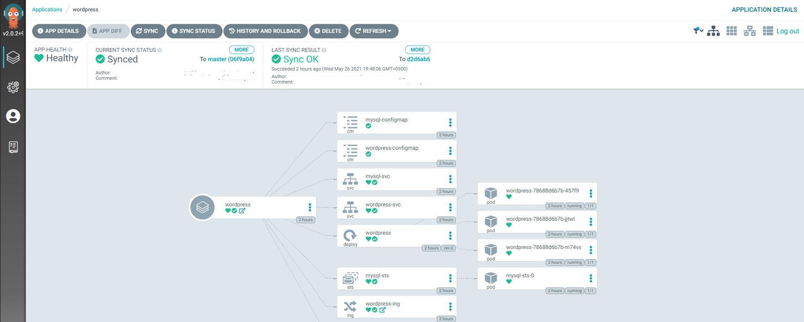
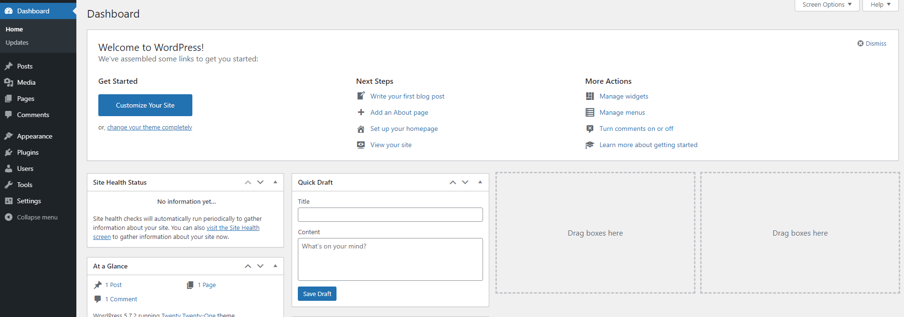
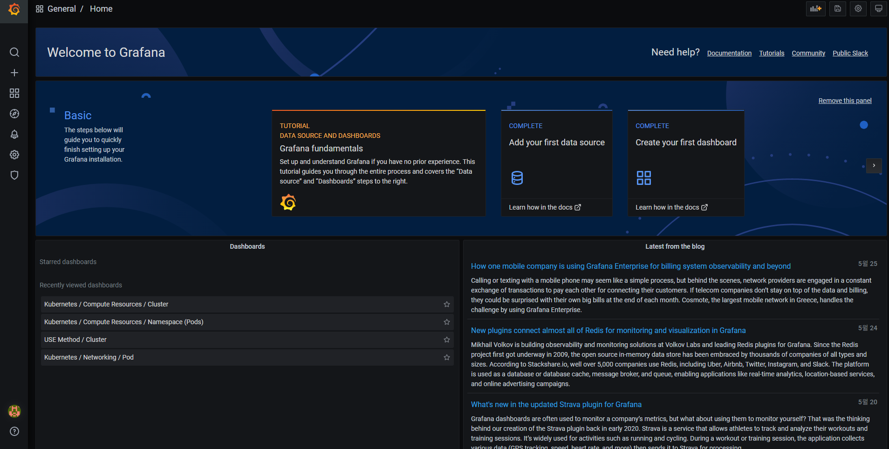

# Deploy Application CI/CD pipeline

Wordpress, MySQL을 이용해 어플리케이션을 만들고, CI/CD 파이프라인으로 배포

- Application
  - Wordpress
  - MySQL

- Cluster
  - Deployment
    - Service(NodePort)
    - configmap
    - PVC
  - Statefulset
    - Service
    - configmap
    - PVC
  - Ingress
- CI
  - Git Registry: Git hub
  - Docker Registry : Docker hub
  - Docker Build : DockerHub Automated Build

- CD
  - Argo CD
- Monitoring 
  - Prometheus (Grafana)

## Application

Wordpress, MySQL을 이용한 어플리케이션 생성  
각각의 어플리케이션 이미지는 Dockerfile로 작성  
Git을 통해 Dockerhub로 이미지 배포

> 도커 허브 레지스트리
> 
> -도커 빌드가 유료화 되면서 삭제-


## Cluster

#### 클러스터 구성


- [Deployment](deploy/deploy-wordpress.yaml)
  - [Service(NodePort)](deploy/deploy-svc.yaml)
  - [configmap](deploy/wordpress-configmap.yaml)
  - [PVC](deploy/wordpress-pvc.yaml)
- [Statefulset](deploy/sts-mysql.yaml)
  - [Service](deploy/sts-svc.yaml)
  - [configmap](deploy/mysql-configmap.yaml)
  - [PVC](deploy/mysql-pvc.yaml)
- [Ingress](deploy/deploy-ing.yaml)


## CI/CD

### CI

1. Git Registry: Git hub 

2. Docker Registry : Docker hub

3. Docker Build : DockerHub Automated Build


### CD

- Argo CD

> https://argo-cd.readthedocs.io/en/stable/#getting-started


Argo CD 설치

```
kubectl create namespace argocd
```

```
kubectl apply -n argocd -f https://raw.githubusercontent.com/argoproj/argo-cd/stable/manifests/install.yaml
```


LoadBalancer 설정

```
kubectl patch svc argocd-server -n argocd -p '{"spec": {"type": "LoadBalancer"}}' 
```


초기 로그인 정보

- ID : admin
- PW   
```
kubectl -n argocd get secret argocd-initial-admin-secret -o jsonpath="{.data.password}" | base64 -d
```


Argo cd 접속

```
kubectl get svc argocd-server -n argocd

NAME            TYPE           CLUSTER-IP      EXTERNAL-IP                                                                                   
argocd-server   LoadBalancer   10.100.67.150   [192.168.*.*]
```


Argo CD 설정


**General**

`Application Name` : [ your App-name ]

`Project` : defalt

`SYNC POLICY` : Automatic


**SOURCE**

`Repository URL` : [ your git repo url ]

`Revision` : [ your branch or tag ]

`Path` : [ your manifest path ]


**DESTINATION**
`Cluster URL` : https://kubernetes.default.svc

`Namespace` : [ your namespace ]


Argo CD 배포




---

#### wordpress 접속

```
kubectl get ingress wordpress-ing
```

```
NAME            CLASS    HOSTS   ADDRESS          
wordpress-ing   <none>   *     [192.168.*.*]
```


접속 확인




## Monitoring

- Prometheus
- Grafana

[Document](https://github.com/prometheus-community/helm-charts/tree/main/charts/kube-prometheus-stack)


Prometheus, grafana 설치

```
helm repo add prometheus-community https://prometheus-community.github.io/helm-charts
helm repo update
```

```
mkdir monitoring
```

- [prometheus-values](monitoring/prom.yaml)
- [grafana-values](monitoring/grafa.yaml)

초기 로그인 정보

- ID: admin
- PW: test1234




